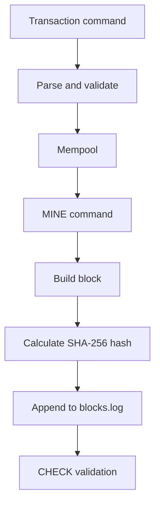

# Mini-Node Design

Mini-Node is a small Rust blockchain-node simulation. It is designed to make the core system ideas visible: command parsing, mempool management, block construction, chained hashing, append-only persistence, and validation.

## Design Goals

- Keep the implementation readable enough for study.
- Avoid external dependencies so the project builds offline.
- Use plain text protocols and logs for easy debugging.
- Separate responsibilities into modules that match the exercises.
- Prefer deterministic validation over production realism.

## System Flow



## Runtime Model

The node can run in two modes.

Server mode:

```bash
cargo run --
```

- Binds to `127.0.0.1:8765` by default.
- Accepts one text command per line over TCP.
- Shares one in-memory `Blockchain` behind `Arc<Mutex<_>>`.
- Persists mined blocks immediately to `blocks.log`.

One-shot mode:

```bash
cargo run -- --once CHECK
printf "TX alice bob 10\nMINE\nCHECK\n" | cargo run -- --once
```

- Loads or creates the chain.
- Processes one command from CLI args or many commands from stdin.
- Keeps mempool only for the lifetime of that process.
- Useful for demos and tests.

## Module Map

```text
src/main.rs
```

CLI entry point. Handles `--addr`, `--log`, `--once`, and server startup.

```text
src/command.rs
```

Command protocol and TCP handling. Converts text commands into operations on `Blockchain`.

```text
src/chain.rs
```

Owns blocks, mempool, append-only log, mining, loading, listing, and chain validation.

```text
src/block.rs
```

Defines `Block`, genesis creation, block hash calculation, and log-line serialization.

```text
src/transaction.rs
```

Defines `Transaction`, parses `TX <from> <to> <amount>`, validates simple input rules, and calculates transaction IDs.

```text
src/mempool.rs
```

Stores pending transactions in FIFO order and prevents duplicate transaction IDs.

```text
src/storage.rs
```

Wraps append-only file operations for `blocks.log`.

```text
src/hash.rs
```

Contains a small SHA-256 implementation so the project has no external dependencies.

```text
src/hash_table.rs
```

Implements the hash-table exercise with chaining, `insert`, `get`, and `remove`.

## Data Structures

Transaction:

```rust
pub struct Transaction {
    pub sender: String,
    pub receiver: String,
    pub amount: u64,
    pub id: String,
}
```

Block:

```rust
pub struct Block {
    pub index: u64,
    pub previous_hash: String,
    pub hash: String,
    pub timestamp: u64,
    pub transactions: Vec<Transaction>,
}
```

Blockchain:

```rust
pub struct Blockchain {
    blocks: Vec<Block>,
    mempool: Mempool,
    log: AppendOnlyLog,
    block_size: usize,
}
```

## Hashing Specification

Transaction ID:

```text
SHA256("tx|<sender>|<receiver>|<amount>")
```

Block hash:

```text
SHA256("block|<previous_hash>|<index>|<timestamp>|<concatenated_tx_ids>")
```

The genesis block uses:

- `index = 0`
- `timestamp = 0`
- `transactions = []`
- `previous_hash = 0000000000000000000000000000000000000000000000000000000000000000`

## Persistence

`blocks.log` is append-only.

```text
BLOCK|0|prev=<zero_hash>|hash=<genesis_hash>|ts=0|txs=0
BLOCK|1|prev=<genesis_hash>|hash=<block_hash>|ts=<unix_seconds>|txs=2|TX alice bob 10|TX bob carol 5
```

Startup behavior:

1. Read every line from the log.
2. Parse each line as a block.
3. Validate the full chain.
4. If the log is missing or empty, create and persist the genesis block.
5. Start with an empty mempool.

This model is simple and replayable. It does not persist mempool contents.

## Validation Algorithm

`CHECK` runs `validate_blocks`.

```text
1. Require at least one block.
2. Verify the genesis index and previous hash.
3. Recalculate every transaction ID.
4. Recalculate every block hash.
5. Verify block indexes are sequential.
6. Verify every previous_hash equals the prior block hash.
```

Complexity is `O(number_of_blocks + number_of_transactions)`.

## Command Protocol

```text
TX <from> <to> <amount>
MINE
CHECK
LIST
HELP
QUIT
```

Rules:

- `amount` must be an unsigned integer greater than zero.
- Sender and receiver cannot be empty, contain whitespace, or contain `|`.
- Duplicate transactions are rejected while they are in the mempool.
- `MINE` takes up to 5 pending transactions per block.

## Design Tradeoffs

This project chooses clarity over realism.

| Feature | Current choice | Why |
| --- | --- | --- |
| Consensus | Single local node | Keeps focus on persistence and validation |
| Hashing | Real SHA-256, no PoW | Shows integrity without mining complexity |
| Storage | Text append-only log | Easy to inspect and replay |
| Network | Local TCP server | Enough to practice protocol handling |
| Mempool | In memory only | Matches the idea of pending, non-final data |
| Serialization | Plain text | Easy to debug with `cat`, `printf`, and `nc` |

## Relationship To Real Nodes

This project shares the shape of a real node:

- Receive transactions.
- Validate command/data format.
- Hold pending transactions.
- Group transactions into blocks.
- Persist blocks.
- Validate chained hashes.

Real nodes add:

- Peer-to-peer gossip
- Cryptographic signatures
- Consensus
- State transitions
- Fees and gas
- Fork choice rules
- Merkle trees
- Snapshots and database indexes
