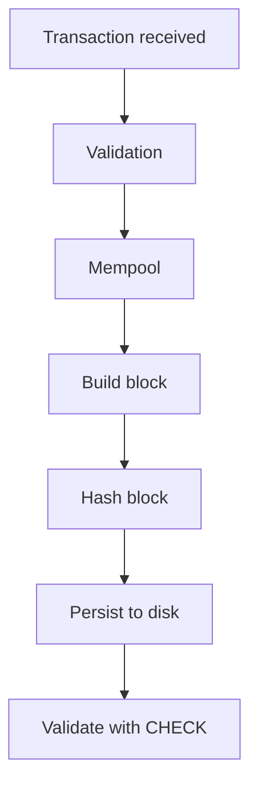

# Applied Computer Science and Mini-Node Roles

These roles organize the project as workstreams. A solo learner can treat each role as a hat to wear; a small team can split the roles between people.

## Project Mission

Build `mini-node-local`: a minimal local blockchain node with a mempool, blocks, chained SHA-256 hashes, append-only disk persistence, a TCP command protocol, and a `CHECK` command that validates chain integrity.

## Learning Resources

- MIT 6.006 Introduction to Algorithms: https://ocw.mit.edu/courses/6-006-introduction-to-algorithms-spring-2020/
- MIT 6.1810 Operating System Engineering: https://pdos.csail.mit.edu/6.1810/
- MIT Missing Semester: https://missing.csail.mit.edu/
- Beej's Guide to Network Programming: https://beej.us/guide/bgnet/

Recommended videos:

- MIT 6.006 lectures 1, 2, 3
- MIT 6.006 hashing, graphs, and complexity lectures
- MIT 6.1810 lectures and xv6 labs as reference material, without trying to complete the whole course

## System Mental Model



## Setup Role

Purpose:

- Keep the project reproducible.

Owns:

- `Cargo.toml`
- `README.md`
- Build and test commands

Commands:

```bash
cargo test
cargo run -- --once HELP
cargo run --
```

## Role 1: Data Structures Engineer

Exercise:

- Implement a simple hash table.

Owns:

- `src/hash_table.rs`

Responsibilities:

- Provide `insert`, `get`, and `remove`.
- Handle collisions with chaining.
- Explain average-case lookup cost.

## Role 2: Persistence Engineer

Exercise:

- Implement append-only storage.

Owns:

- `src/storage.rs`
- The `blocks.log` format

Responsibilities:

- Append block records without rewriting history.
- Read log lines during startup.
- Explain replay-based recovery.

## Role 3: Network Protocol Engineer

Exercise:

- Create a simple TCP server.

Owns:

- `src/command.rs`
- TCP command behavior

Responsibilities:

- Listen on `127.0.0.1:8765` by default.
- Accept one command per line.
- Return clear `OK` or `ERROR` responses.

## Role 4: Transaction Parser

Exercise:

- Receive transactions in text format.

Owns:

- `src/transaction.rs`

Responsibilities:

- Parse `TX <from> <to> <amount>`.
- Validate simple input rules.
- Calculate transaction IDs with SHA-256.

## Role 5: Mempool Engineer

Exercise:

- Store pending transactions in memory.

Owns:

- `src/mempool.rs`

Responsibilities:

- Keep pending transactions in FIFO order.
- Reject duplicates while pending.
- Drain batches for mining.

## Role 6: Block Producer

Exercise:

- Group transactions into blocks.

Owns:

- `src/block.rs`
- Mining behavior in `src/chain.rs`

Responsibilities:

- Take up to 5 transactions per block.
- Link each block to the previous hash.
- Calculate deterministic block hashes.

## Role 7: Chain Storage Engineer

Exercise:

- Persist blocks to disk.

Owns:

- Block serialization in `src/block.rs`
- Chain loading in `src/chain.rs`

Responsibilities:

- Create the genesis block when needed.
- Append every mined block.
- Reload and validate the chain on startup.

## Role 8: Chain Integrity Engineer

Exercise:

- Write the `CHECK` command.

Owns:

- Validation in `src/chain.rs`

Responsibilities:

- Recalculate transaction IDs.
- Recalculate block hashes.
- Verify previous-hash links.
- Report where the chain breaks.

## Role 9: Documentation and Portfolio Engineer

Exercise:

- Turn the project into a portfolio artifact.

Owns:

- `README.md`
- `docs/DESIGN.md`
- `docs/EXERCISES.md`
- `docs/ROLES.md`

Responsibilities:

- Explain the project objective.
- Show how to build and run.
- Document command protocol and storage format.
- Explain limitations and relationship to real nodes.

## Expected Final Outcomes

You should be able to explain:

- Why blockchain is a distributed system, not just a database.
- How consensus, finality, latency, and failures relate.
- Why computational cost matters in smart contracts.
- How append-only persistence supports replay.
- How chained hashes make tampering detectable.

## Scope Boundaries

This project intentionally does not include:

- Real peer-to-peer networking
- Proof of work or proof of stake
- Cryptographic signatures
- Smart contract execution
- Transaction fees or gas
- Full distributed consensus
